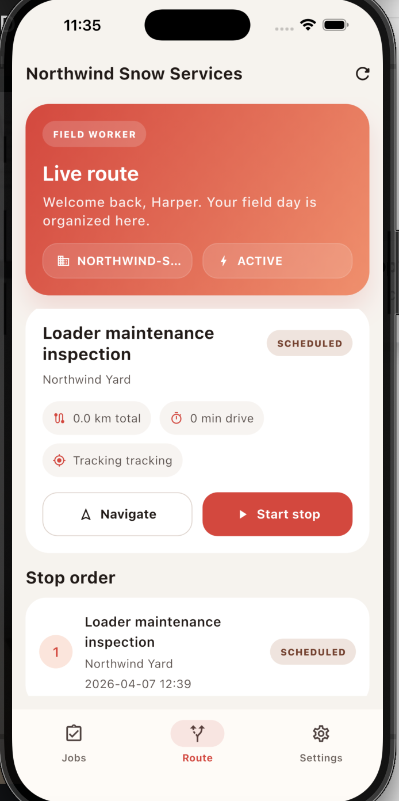
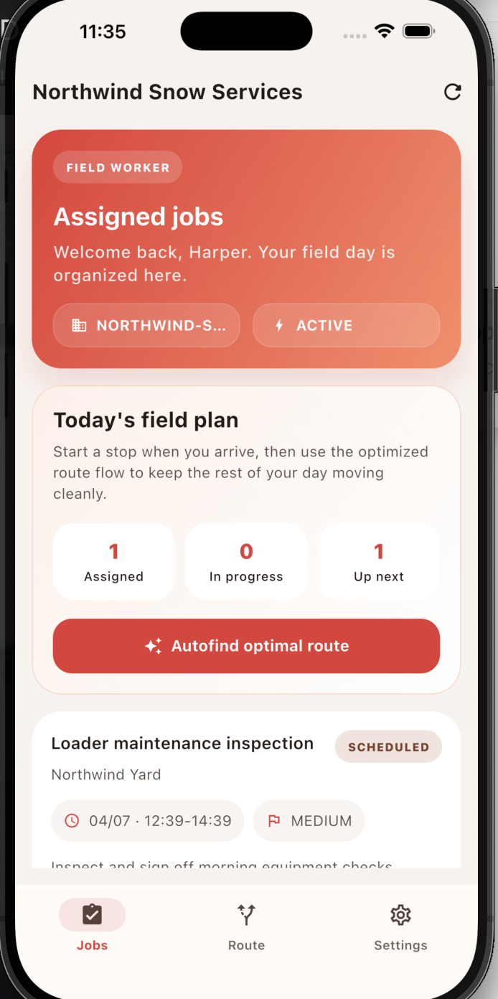

# Tadester Ops — Field Operations Platform

A full-stack platform designed to manage teams, assign jobs, optimize routing, and coordinate field operations across web and mobile.

Built as a real product — not just a project.

---

## 🚀 Live Demo
👉 https://tadester-ops.netlify.app/

---

## 🧠 What This Project Shows

- End-to-end product thinking (not just isolated features)
- Full-stack system design across web, backend, and mobile
- Real-world problem solving (logistics, workforce coordination)
- Clean architecture and scalable data modeling
- Ability to ship multi-platform systems

---

## ⚙️ Core Features

### 👥 Role-Based System
- Admin, dispatcher, and field worker roles
- Role-aware dashboards and permissions
- Secure authentication and access control

---

### 📋 Job & Task Management
- Create, assign, and track jobs
- Real-time updates on job status
- Structured workflows for operations teams

---

### 🗺️ Routing & Field Coordination
- Worker routing logic
- Location-aware assignments
- Optimized field operations flow

---

### 📱 Mobile Workforce App
- Built with Flutter
- Field workers receive and update tasks in real-time
- Clean UI designed for speed and usability in the field

---

### 🌐 Web Platform
- Next.js frontend for landing and dashboard experiences
- Fast, responsive, and product-focused UI

---

## 🏗️ System Architecture
-Frontend (Next.js)
-↓
-Backend API (Node.js / TypeScript)
-↓
-Database (Supabase / PostgreSQL)
-↓
-Mobile App (Flutter)
---

## 🧩 Tech Stack

**Frontend**
- Next.js
- TypeScript

**Backend**
- Node.js
- TypeScript
- Supabase

**Database**
- PostgreSQL

**Mobile**
- Flutter (Dart)

**Validation / Structure**
- Zod (schema validation)

---

## 🔥 Key Engineering Decisions

- Designed as a **multi-role system** instead of a single-user app
- Structured backend with **typed APIs and clear data contracts**
- Used Supabase for **auth + database integration**
- Built mobile and web to work off the same backend system
- Focused on **real-world usability**, not just UI polish

---

## 🎯 Why This Project Matters

Most portfolio projects are static or isolated.

Tadester Ops is different:
- It behaves like a real SaaS product
- It connects multiple systems (web + backend + mobile)
- It solves a practical operations problem

This is the kind of system companies actually build.

---

## 📸 Screenshots

_Add screenshots here (very important)_

---

## 🚧 Future Improvements

- Real-time tracking (WebSockets)
- Advanced route optimization (maps + algorithms)
- Notifications system (push + email)
- Analytics dashboard for operations performance
- Multi-tenant architecture for scaling

---

## 📬 Contact

- GitHub: https://github.com/tadester  
- LinkedIn: https://linkedin.com/in/tadeobasan  
- Email: Obasantade@gmail.com  

---

## ⚡ Final Note

This project was built to demonstrate how I think about systems:

Not just writing code —  
but designing, structuring, and shipping real products.

---

### Landingpage
https://tadester-ops.netlify.app/

## 📸 Screenshots
### Mobile App

